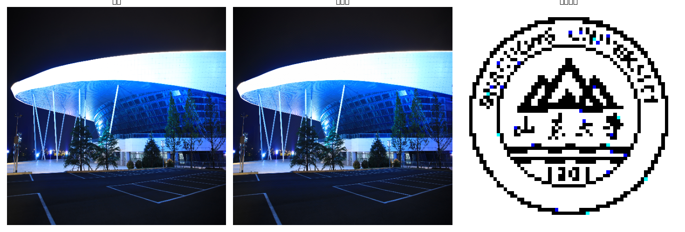
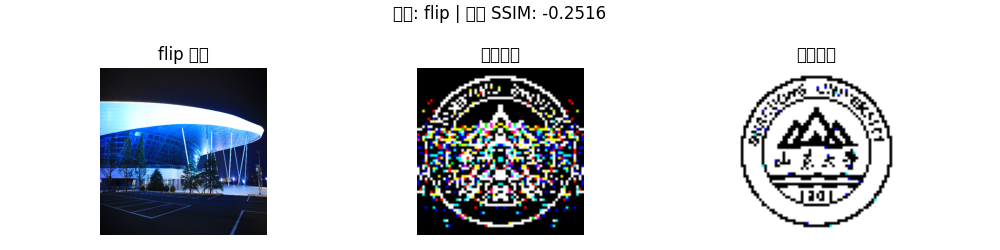
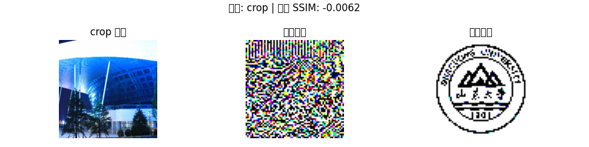
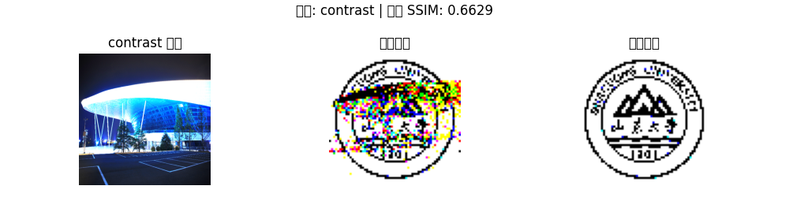
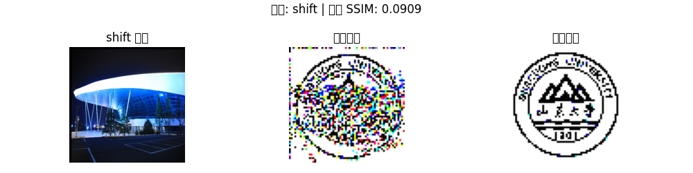
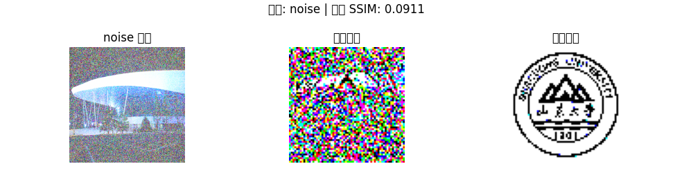
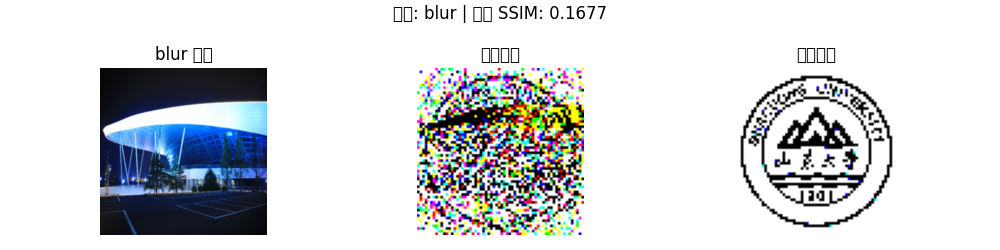
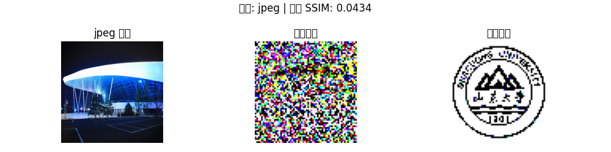

# Project2
本项目实现了基于**离散余弦变换（DCT）**的图像水印嵌入与提取系统，支持 **灰度图像** 和 **彩色图像** 两种模式，并包含针对多种常见图像攻击的鲁棒性测试模块（如翻转、裁剪、添加噪声等）。

## 📌项目特点
- 支持灰度图像和彩色图像的水印嵌入与提取
- 使用 DCT 域中低频系数嵌入水印，保证鲁棒性
- 多种图像攻击模拟与 SSIM 相似度评估
- 可视化展示水印嵌入与提取效果

## 🗂️项目结构
project2/<br>
├── docs/<br>
│   ├── results/    # 存放结果图片<br>
│   │   └── figures.png<br>
│   ├── Project2.py # 灰度图像水印嵌入与提取<br> 
│   ├── Project2_colorful.py # 彩色图像水印嵌入与提取<br>
│   ├── my_photo.jpg # 原始图像<br>
│   ├── SDU_logo.jpg # 水印图像<br>
│   └── README.md<br>


## 🛠️安装依赖
请确保使用 Python 3.x，并安装以下依赖：  
```bash
pip3 install numpy opencv-python matplotlib scipy scikit-image
```
## 🧠方法原理简介
1. DCT 变换：图像划分为 8x8 块并进行二维 DCT。
2. 水印嵌入：根据水印图像每个像素的值，对 DCT 系数中的特定位点（如 (4,3)）加减扰动。
3. 水印提取：提取图像进行同样 DCT，并与原图差值判断水印位。
4. 鲁棒性测试：对嵌入图像进行常见图像处理后尝试恢复水印。

## 📷输入图像准备
- my_photo.jpg：原始图像，将作为水印嵌入的载体。建议尺寸不小于 512x512。  
- SDU_logo.jpg：水印图像，会被缩放为 64x64 嵌入图像中。

## 🧩 重点代码解释
1. embed_watermark() / embed_watermark_color()
功能：将二值水印嵌入到图像的 DCT 系数中。

```python
dct_block = dct(dct(block.T, norm='ortho').T, norm='ortho')
```
- 对图像的每个 8x8 块进行二维 DCT。
- 使用 scipy.fftpack.dct 函数，norm='ortho' 保证正交性。

```python
if watermark[i, j] > 128:
    dct_block[4, 3] += alpha
else:
    dct_block[4, 3] -= alpha
```
- 修改 DCT 系数中的 (4,3) 位置（中低频），嵌入水印信息。
- alpha 是控制嵌入强度的参数。
```python
block_idct = idct(idct(dct_block.T, norm='ortho').T, norm='ortho')
```
- 进行逆 DCT（IDCT）恢复图像块。

2. extract_watermark() / extract_watermark_color()
功能：从嵌入过水印的图像中提取水印。

```python
diff = dct_wm[4, 3] - dct_orig[4, 3]
extracted[i, j] = 255 if diff > 0 else 0
```
- 比较水印图像和原始图像在 DCT 域 (4,3) 处的差值。
- 判断是嵌入 1（255）还是 0（0），重建水印图像。

3. apply_attack(image, attack_type)
功能： 对图像进行攻击（扰动）测试水印鲁棒性。
常见攻击操作：
```python
attacked = cv2.flip(attacked, 1)                  # 翻转攻击
attacked = cv2.GaussianBlur(attacked, (5,5), 0)   # 模糊攻击
attacked = cv2.convertScaleAbs(attacked, alpha=1.8)  # 对比度增强
```
- 对图像模拟真实环境中可能出现的各种失真情况。
- JPEG 压缩、裁剪、噪声等也被包含。

4. ssim() - 结构相似性评价
```python
similarity = ssim(watermark_bin, extracted)
```
- 使用 skimage.metrics.structural_similarity 计算原始水印和提取水印之间的相似性。
- 值域为 [0, 1]，越接近 1 表示越相似。

彩色图中会对 R/G/B 三个通道分别计算 SSIM：  
```python
avg_ssim = (ssim_r + ssim_g + ssim_b) / 3
```
5. 图像显示辅助函数
```python
plt.imshow(image, cmap='gray') # 灰度图显示
plt.imshow(cv2.cvtColor(image,cv2.COLOR_BGR2RGB)) # 彩色图显示
```
用 Matplotlib 可视化每一步结果，辅助调试和分析。

## ⚙️ 参数解释
| 参数 | 说明 |
| alpha | 水印嵌入强度，数值越大嵌入越明显但鲁棒性越强 |
| block size | 每个 8x8 的图像块进行 DCT 处理 |
| dct[4,3] | 嵌入/提取 DCT 系数的位置，可调整（如[3,2]、[5,4]等）|
| SSIM | 衡量原始与提取水印的结构相似性 |

## 🚀使用说明
### 灰度图像版本
运行以下命令：  
```bash
python3 Project2.py
```
功能：  
- 将原图转为灰度并调整为 512x512 尺寸
- 将水印图转为二值图并嵌入
- 提取嵌入后的水印进行可视化
- 对多种攻击（如翻转、裁剪、噪声等）进行测试并输出 SSIM 相似度
### 彩色图像版本
运行以下命令：  
```bash
python3 dct_watermark_color.py
```
功能：  
- 彩色原图处理并调整为 512x512
- 对 RGB 通道分别嵌入水印图像（彩色二值化）
- 可视化提取结果
- 模拟攻击后提取水印并评估平均 SSIM

## 🧪支持的攻击类型
以下攻击可用于验证水印鲁棒性：  
｜ **攻击类型** ｜ **描述** ｜
｜ flip ｜ 水平翻转 ｜
｜ crop ｜ 中心裁剪并缩放还原 ｜
｜ contrast ｜ 对比度增强 ｜
｜ shift ｜ 平移变换 ｜
｜ noise ｜ 添加高斯噪声 ｜
｜ blur ｜高斯模糊 ｜
｜ jpeg ｜ JPEG压缩（质量为50）｜
每种攻击后会提取水印并计算 SSIM 指标（结构相似度指数）以衡量失真程度。

## 📊输出示例（彩色）
```yaml
📊 攻击类型与平均SSIM相似度：
flip      : SSIM = -0.2516
crop      : SSIM = -0.0062
contrast  : SSIM = 0.6629
shift     : SSIM = 0.0909
noise     : SSIM = 0.0911
blur      : SSIM = 0.1677
jpeg      : SSIM = 0.0434
```
**输出结果：**









## 📩 联系方式与致谢
- 联系方式：1779551322@qq.com
- 使用了 OpenCV, SciPy, Matplotlib, skimage 等开源工具
欢迎学习、实验和进一步优化算法！