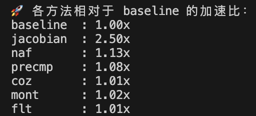
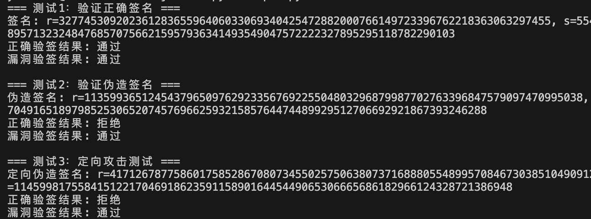
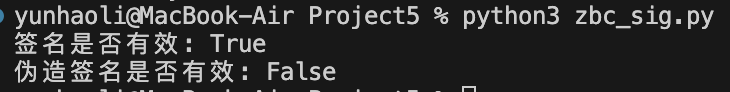

# SM2椭圆曲线数字签名算法实现与优化
作者：李云昊<br>
邮箱：1779551322@qq.com  
许可证：MIT  

## 项目概述
本项目实现了国密SM2椭圆曲线数字签名算法，包含基础签名/验签功能、多种优化实现、性能测试以及安全性验证。主要包含以下文件：  
```text
project5
├── zbc_sig.py：ECDSA基础签名示例
├── poc.py：SM2正确/漏洞验签对比
├── curve_params.py：SM2曲线参数定义
├── sm2_all.py：多种优化实现的SM2算法
├── benchmark.py：优化方法性能测试
└── README.md
```
## 算法原理
```text
SM2签名算法原理
系统参数
•	p：定义有限域的大素数
•	a, b：椭圆曲线方程 y² = x³ + ax + b 的系数
•	G：曲线上的基点（生成元）
•	n：基点G的阶（即 n×G = 无穷远点）
•	d：用户私钥（1 ≤ d ≤ n-1）
•	Q：用户公钥 = d×G（椭圆曲线点乘）
签名生成步骤
1.	计算消息哈希值：
e = Hash(M)，结果转换为整数
2.	生成随机数k：
k ∈ [1, n-1]
3.	计算曲线点：
(x₁, y₁) = k×G （G的k倍点）
4.	计算r值：
r = (e + x₁) mod n
→ 如果r=0或r+k=n，需重新选择k
5.	计算s值：
s = [ (1 + d)⁻¹ × (k - r×d) ] mod n
→ 如果s=0，需重新选择k
最终签名为(r, s)这对整数
签名验证步骤
1.	检查范围：
验证 r, s ∈ [1, n-1]
2.	计算中间值：
t = (r + s) mod n
3.	计算曲线点：
(x₁, y₁) = s×G + t×Q
（两个点乘和一个点加）
4.	计算验证值：
R = (e + x₁) mod n
5.	验证结果：
当且仅当 R ≡ r (mod n) 时通过验证
```
## 关键数学运算
1. 点加（Point Addition）：
```text
λ = (y₂ - y₁)/(x₂ - x₁) mod p
x₃ = λ² - x₁ - x₂ mod p
y₃ = λ(x₁ - x₃) - y₁ mod p
```
2. 点倍（Point Doubling）：
```text
λ = (3x₁² + a)/(2y₁) mod p
x₃ = λ² - 2x₁ mod p
y₃ = λ(x₁ - x₃) - y₁ mod p
```
3. 标量乘法（Scalar Multiplication）：
```python
def scalar_mult(k, P):
    R = None
    while k:
        if k & 1: R = point_add(R, P)
        P = point_double(P)
        k >>= 1
    return R
```
## 重点代码解析
1. 基础签名实现(sm2_all.py)
```python
def extended_sign_scalar(msg: bytes, d: int, method: str):
    e = hash_msg(msg)
    while True:
        k = random.randint(1, n - 1)
        # 根据优化方法选择点乘实现
        if method == 'baseline':
            x1, _ = scalar_mult(k, G)
        # ...其他优化方法...
        
        r = (e + x1) % n
        if r == 0 or r + k == n: continue
        s = (inverse_mod(1 + d, n) * (k - r * d)) % n
        if s != 0: break
    return (r, s)
```
2. Jacobian坐标优化
通过投影坐标减少模逆运算：  
```python
def jacobian_add(P, Q):
    X1, Y1, Z1 = P
    X2, Y2, Z2 = Q
    if Z1 == 0: return Q
    if Z2 == 0: return P
    
    Z1Z1 = pow(Z1, 2, p)
    Z2Z2 = pow(Z2, 2, p)
    U1 = (X1 * Z2Z2) % p
    U2 = (X2 * Z1Z1) % p
    S1 = (Y1 * Z2 * Z2Z2) % p
    S2 = (Y2 * Z1 * Z1Z1) % p
    
    H = (U2 - U1) % p
    R = (S2 - S1) % p
    if H == 0:
        if R == 0: return jacobian_double(P)
        else: return (0, 0, 0)
    
    HH = (H * H) % p
    HHH = (H * HH) % p
    V = (U1 * HH) % p
    X3 = (R * R - HHH - 2 * V) % p
    Y3 = (R * (V - X3) - S1 * HHH) % p
    Z3 = (Z1 * Z2 * H) % p
    return (X3, Y3, Z3)
```
3. NAF编码优化
减少点加运算次数：  
```python
def naf_encode(k):
    naf = []
    while k > 0:
        if k & 1:
            z = 2 - (k % 4)  # 生成-1,0,1序列
            naf.append(z)
            k -= z
        else:
            naf.append(0)
        k >>= 1
    return naf

def scalar_mult_naf(k, P):
    naf = naf_encode(k)
    Q = None
    for digit in reversed(naf):
        Q = point_double(Q)
        if digit == 1:
            Q = point_add(Q, P)
        elif digit == -1:
            Q = point_add(Q, (P[0], (-P[1]) % p))
    return Q
```
4. 预计算表优化
```python
def precompute_table(P, window_size=4):
    table = {}
    for i in range(1, 2**(window_size-1), 2):  # 预计算奇数倍点
        table[i] = scalar_mult(i, P)
    return table

def scalar_mult_precmp(k, P):
    w = 4  # 窗口大小
    table = precompute_table(P, w)
    naf = naf_encode(k)
    Q = None
    for digit in reversed(naf):
        Q = point_double(Q)
        if digit != 0:
            point = table[abs(digit)]
            if digit < 0:  # 处理负系数
                point = (point[0], (-point[1]) % p)
            Q = point_add(Q, point)
    return Q
```
5. 安全性验证（poc.py）
漏洞验签实现:   
```python
def vulnerable_verify(msg: bytes, Q, sig):
    r, s = sig
    e = hash_msg(msg)
    x1_prime = (r - e) % n  # 错误：未进行实际点运算
    return True  # 总是返回验证通过
```
6. 伪造签名测试：
```python
# 定向伪造签名攻击
e = hash_msg(msg)
r_fake = random.randint(1, n-1)
x1_prime = (r_fake - e) % n
s_fake = random.randint(1, n-1)
forged_sig_target = (r_fake, s_fake)

# 正确验签应拒绝伪造签名
result_correct = correct_verify(msg, Q, forged_sig_target)  # False

# 漏洞验签会接受伪造签名
result_vuln = vulnerable_verify(msg, Q, forged_sig_target)  # True
```
7. 性能测试（benchmark.py）
测试七种优化方法:  
1. baseline：基础仿射坐标实现
2. jacobian：Jacobian坐标优化
3. naf：NAF编码优化
4. precmp：预计算表优化
5. coz：Co-Z优化
6. mont：Montgomery模乘
7. flt：FLT模逆优化

## 运行说明
1. 安装依赖
```bash
pip install ecdsa
```
2. 运行测试
```bash
# 性能测试
python benchmark.py
# SM2正确性验证
python poc.py
# ECDSA基础示例
python zbc_sig.py
```

## 运行结果




